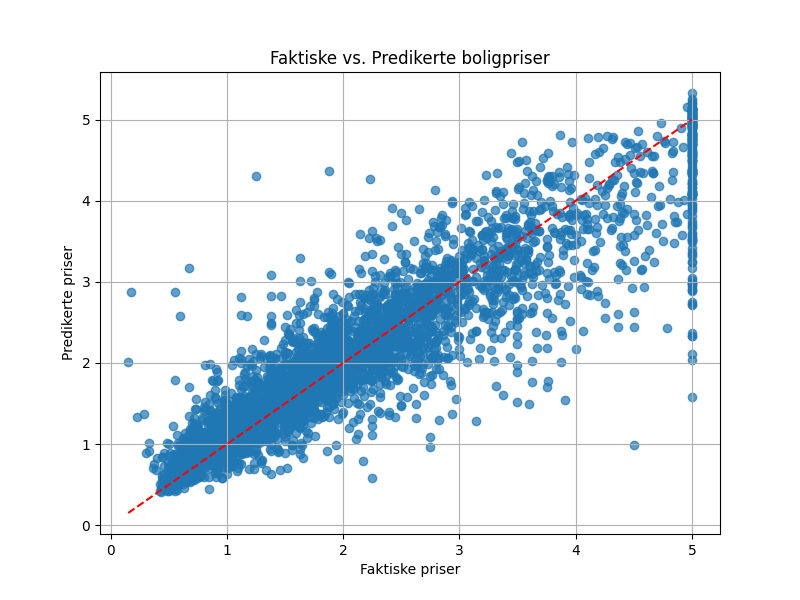

# Predicting Housing Prices using XGBoost and California Housing Dataset

This project demonstrates how to build a machine learning model using **XGBoost** to predict housing prices based on various features. The dataset used is the **California Housing Prices** dataset from Scikit-Learn.

---

## **Project Overview**

The project includes the following steps:

1. **Data Loading**:
   - The dataset contains information about median income, house age, average rooms, average bedrooms, population, and geographical coordinates.
2. **Data Preprocessing**:
   - Handled missing values.
   - Feature engineering was applied to create meaningful features.
3. **Model Training**:
   - Trained an XGBoost regression model to predict median house values.
4. **Evaluation**:
   - The model was evaluated using **R²** and **Mean Squared Error (MSE)**.
5. **Visualization**:
   - Compared predicted prices to actual prices in a scatter plot.

---

## **Dataset**

| Feature       | Description                               |
| ------------- | ----------------------------------------- |
| `MedInc`      | Median income of households               |
| `HouseAge`    | Median age of houses                      |
| `AveRooms`    | Average number of rooms per household     |
| `AveBedrms`   | Average number of bedrooms per household  |
| `Population`  | Population in the block group             |
| `AveOccup`    | Average number of occupants per household |
| `Latitude`    | Latitude of the block group               |
| `Longitude`   | Longitude of the block group              |
| `MedHouseVal` | Median house value (target variable)      |

---

## **Results**

### **Model Evaluation Metrics**

- **R² Score**: `0.8278`
- **Mean Squared Error (MSE)**: `0.2256`

The model demonstrates strong predictive performance with an R² score of 0.83, meaning it explains approximately 83% of the variance in housing prices.

---

## California Housing Dataset Sample

| MedInc | HouseAge | AveRooms | AveBedrms | Population | AveOccup | Latitude | Longitude | MedHouseVal |
| ------ | -------- | -------- | --------- | ---------- | -------- | -------- | --------- | ----------- |
| 8.3252 | 41.0     | 6.984127 | 1.023810  | 322.0      | 2.555556 | 37.88    | -122.23   | 4.526       |
| 8.3014 | 21.0     | 6.238137 | 0.971880  | 2401.0     | 2.109842 | 37.86    | -122.22   | 3.585       |
| 7.2574 | 52.0     | 8.288136 | 1.073446  | 496.0      | 2.802260 | 37.85    | -122.24   | 3.521       |
| 5.6431 | 52.0     | 5.817352 | 1.073059  | 558.0      | 2.547945 | 37.85    | -122.25   | 3.413       |
| 3.8462 | 52.0     | 6.281853 | 1.081081  | 565.0      | 2.181467 | 37.85    | -122.25   | 3.422       |

### **Feature Descriptions**

- **MedInc**: Median income of households (in tens of thousands of dollars).
- **HouseAge**: Median age of the houses in the block.
- **AveRooms**: Average number of rooms per household.
- **AveBedrms**: Average number of bedrooms per household.
- **Population**: Total population of the block.
- **AveOccup**: Average number of occupants per household.
- **Latitude**: Latitude coordinate of the block.
- **Longitude**: Longitude coordinate of the block.
- **MedHouseVal**: Median house value for households (in hundreds of thousands of dollars).

---

### **Visualization**

The scatter plot below compares the **actual housing prices** to the **predicted housing prices**. The red line represents the perfect prediction line (`y = x`).



---

## **How to Run the Project**

### Prerequisites

Ensure you have the following libraries installed:

- `pandas`
- `numpy`
- `scikit-learn`
- `xgboost`
- `matplotlib`

Install them using:

```bash
pip install pandas numpy scikit-learn xgboost matplotlib
```

### Steps to Run

#### 1. Run the python script

```bash
python source.py
```

2. Output:

```bash
R² Score: 0.8278
Mean Squared Error: 0.2256
```

- Model evaluation metrics will be displayed.
- A scatter plot will be saved as `image.png`.

### Key Insights

- the model explains 83% of the variance in housing prices.
- The scatter plot shows a strong positive correlation between actual and predicted prices.
- Some deviations exist for extreme values, which could be addressed with further feature engineering.
